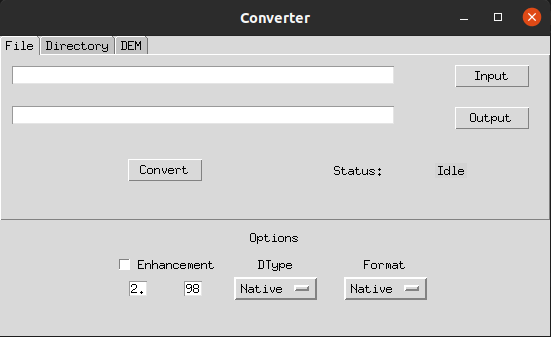

<h1> Usage </h1>

=== "Windows"

    

=== "Linux"

    

## I/O tabs
The GUI consists of three tabs for specifying input and output:

- **File** : Input is a single file and output is a single file
- **Directory**: Input is a directory and output is a directory
- **DEM**: Input is a DEM raster and output is a directory 

## Options
There are three main settings in the conversion process:

- **Dtype**: Output dtype format. Supports all valid gdal datatypes. Select `Native` if you want the output dtype to be same as that of input. 
- **Format**: Output file format. Select `Native` if you want the output format to be same as that of input. 
        
        Supports the following formats:
            Raster:
                * Cloud Optimized GeoTiff (COG), 
                * GeoTiff (GTiff), 
                * JPEG2000 (based on OpenJPEG library), 
                * Erdas Imagine (IMG). 
            3D:
                * Cesium Terrain files (Terrain)
                * Quantized Mesh (Mesh)

- **Contrast Enhancement**: Apply percentile stretch to output raster.
 