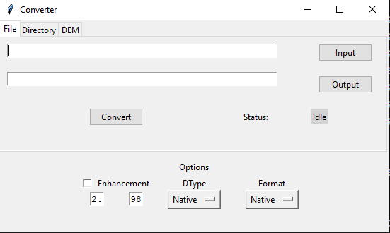
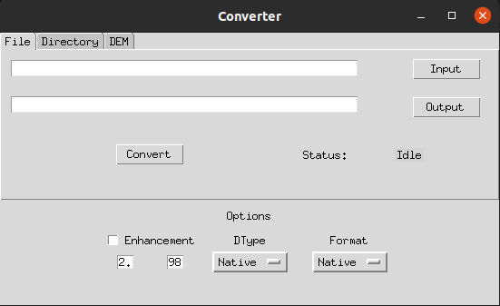

# Usage

Geoconverter provides both command-line and graphical interfaces for converting geospatial raster formats.

## Command Line Interface (CLI)

### Basic Usage

```bash
geoconverter -i input.tif -o output.tif -of GTiff
```

### Command Syntax

```bash
geoconverter [-h] [--version] [-i INPUT] [-b BANDS] [-o OUTPUT]
             [-of FORMAT] [-ot DTYPE] [-or RANGE RANGE] {stretch} ...
```

### Parameters

| Parameter | Description | Example |
|-----------|-------------|---------|
| `-i, --input` | Input raster file or directory | `-i data.tif` |
| `-o, --output` | Output raster file or directory | `-o result.tif` |
| `-of, --format` | Output format (default: Native) | `-of COG` |
| `-ot, --dtype` | Output data type (default: Native) | `-ot UInt16` |
| `-b, --bands` | Band selection (comma-separated) | `-b 5,3,2` |
| `-or, --range` | Output range (min max) | `-or 0 255` |
| `--version` | Show version information | |

### Supported Formats

**Raster Formats:**
- **COG** - Cloud Optimized GeoTIFF
- **GTiff** - GeoTIFF
- **JP2OpenJPEG** - JPEG2000 (OpenJPEG)
- **HFA** - Erdas Imagine (.img)
- **Native** - Keep source format

**3D/Terrain Formats:**
- **Terrain** - Cesium Terrain tiles
- **Mesh** - Quantized Mesh

**Data Types:**
- Byte (0-255)
- UInt16 (0-65535)
- UInt32 (0-4294967295)
- Int16 (-32768 to 32767)
- Int32 (-2147483648 to 2147483647)
- Float32 (0.0-1.0)
- Float64 (0.0-1.0)

### CLI Examples

#### Basic Format Conversion

```bash
# Convert TIFF to Cloud Optimized GeoTIFF
geoconverter -i input.tif -o output_cog.tif -of COG

# Convert to JPEG2000
geoconverter -i input.tif -o output.jp2 -of JP2OpenJPEG

# Convert directory of files
geoconverter -i /data/input/ -o /data/output/ -of GTiff
```

#### Data Type Conversion

```bash
# Convert to 16-bit unsigned
geoconverter -i input.tif -o output.tif -ot UInt16

# Convert with custom range
geoconverter -i input.tif -o output.tif -ot Byte -or 0 255
```

#### Band Selection

```bash
# Select RGB bands (bands 3,2,1)
geoconverter -i multispectral.tif -o rgb.tif -b 3,2,1

# Create false color composite (NIR, Red, Green)
geoconverter -i multispectral.tif -o false_color.tif -b 5,3,2 -of JP2OpenJPEG
```

#### Contrast Enhancement

```bash
# Apply 2% to 98% percentile stretch
geoconverter -i input.tif -o enhanced.tif stretch -s 2 98

# Directory processing with contrast stretch
geoconverter -i /data/in/ -o /data/out/ -of COG stretch -s 5 95
```

#### Advanced Examples

```bash
# Multi-band with type conversion and stretch
geoconverter -i landsat.tif -o output.tif -b 5,4,3 -ot UInt16 stretch -s 1 99

# Batch processing with custom range
geoconverter -i /imagery/ -o /processed/ -of COG -ot Byte -or 0 255

# Keep native format but apply contrast enhancement
geoconverter -i input.tif -o enhanced.tif stretch -s 2 98
```

### DEM Processing

For Digital Elevation Models, geoconverter can create Cesium terrain tiles:

```bash
# Create Cesium terrain tiles from DEM
geoconverter -i dem.tif -o terrain_tiles/ -of Terrain

# Create quantized mesh tiles
geoconverter -i dem.tif -o mesh_tiles/ -of Mesh
```

## Graphical User Interface (GUI)

Launch the GUI application:

```bash
geoconverter-gui
```

### GUI Overview

=== "Windows"
    

=== "Linux"
    

### Interface Tabs

The GUI provides three processing modes:

#### 1. File Tab
- **Input**: Select single raster file
- **Output**: Specify output file path
- **Use case**: Converting individual files

#### 2. Directory Tab
- **Input**: Select input directory containing rasters
- **Output**: Select output directory for processed files
- **Use case**: Batch processing multiple files

#### 3. DEM Tab
- **Input**: Select Digital Elevation Model file
- **Output**: Select output directory for terrain tiles
- **Use case**: Creating Cesium terrain or quantized mesh tiles

### Configuration Options

#### Data Type (Dtype)
- **Native**: Keep original data type
- **Byte**: 8-bit unsigned (0-255)
- **UInt16**: 16-bit unsigned (0-65535)
- **UInt32**: 32-bit unsigned
- **Int16**: 16-bit signed
- **Int32**: 32-bit signed
- **Float32**: 32-bit floating point
- **Float64**: 64-bit floating point

#### Output Format
- **Native**: Keep original format
- **COG**: Cloud Optimized GeoTIFF
- **GTiff**: Standard GeoTIFF
- **JPEG2000**: JPEG2000 compression
- **IMG**: Erdas Imagine format
- **Terrain**: Cesium terrain tiles (DEM only)
- **Mesh**: Quantized mesh tiles (DEM only)

#### Contrast Enhancement
- **Enable**: Apply percentile-based contrast stretching
- **Lower Percentile**: Lower bound (default: 2%)
- **Upper Percentile**: Upper bound (default: 98%)

### GUI Workflow

1. **Select Tab**: Choose File, Directory, or DEM based on your needs
2. **Set Input**: Browse and select input file(s) or directory
3. **Set Output**: Specify output location
4. **Configure Options**:
   - Choose output data type
   - Select output format
   - Enable contrast enhancement if needed
5. **Process**: Click the process button to start conversion
6. **Monitor**: Watch the status bar for progress and completion

### Status Indicators

- **Idle** (Gray): Ready for input
- **Processing** (Green): Conversion in progress
- **Complete** (Blue): Processing finished successfully
- **Error** (Red): Error occurred - check error dialog

## Performance Tips

### Large File Processing

**For Large Rasters:**
- Use COG format for better performance
- Consider tiling for very large datasets
- Monitor system memory usage

**Batch Processing:**
- Process similar files together
- Use consistent output formats
- Ensure sufficient disk space

### Memory Management

**CLI Processing:**
- Process files individually for very large datasets
- Use appropriate data types to minimize memory usage
- Monitor available system resources

**GUI Processing:**
- Close other applications for large file processing
- Consider using CLI for very large batch operations

## Troubleshooting

### Common Issues

#### File Not Found Errors
```
FileNotFoundError: input.tif not found
```
- Check file paths are correct
- Ensure files exist and are readable
- Use absolute paths when in doubt

#### Format Not Supported
```
AssertionError: Invalid Driver
```
- Check format name spelling
- Use `gdalinfo --formats` to list supported formats
- Ensure GDAL supports the target format

#### Memory Errors
```
MemoryError: Unable to allocate array
```
- Reduce processing area or use tiling
- Use lower precision data types
- Process files individually instead of batch

#### Permission Errors
```
PermissionError: [Errno 13] Permission denied
```
- Check write permissions on output directory
- Ensure output files are not open in other applications
- Try running with administrator privileges if needed

### Getting Help

For additional support:
- Check the [Installation](installation.md) guide for setup issues
- Review [GDAL compatibility](gdal-compatibility.md) for version-specific problems
- Visit the [GitHub repository](https://github.com/ashnair1/geoconverter) to report issues
- Use `geoconverter --help` for quick CLI reference

## Examples Repository

Find more detailed examples and sample datasets at:
[geoconverter-examples](https://github.com/ashnair1/geoconverter-examples)
